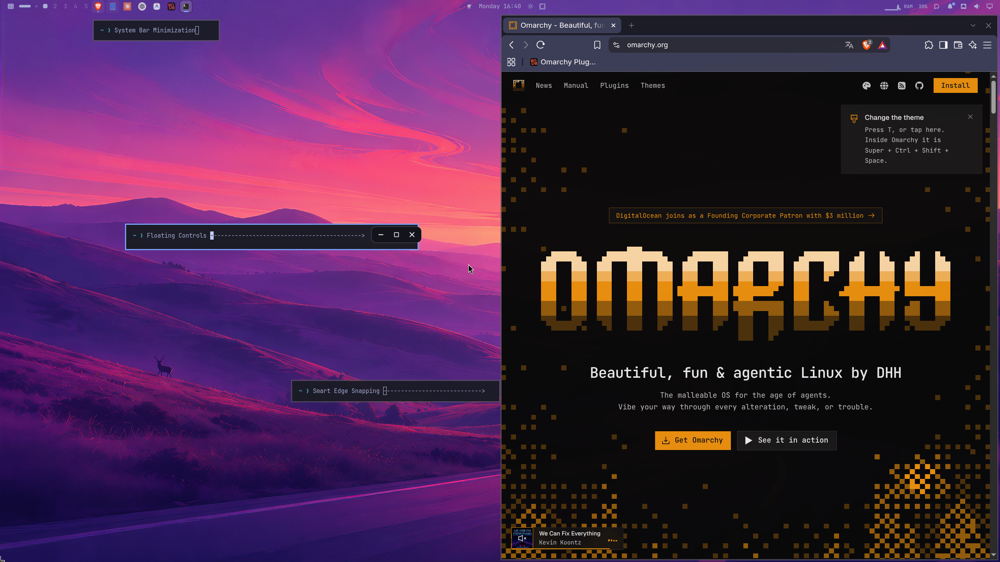
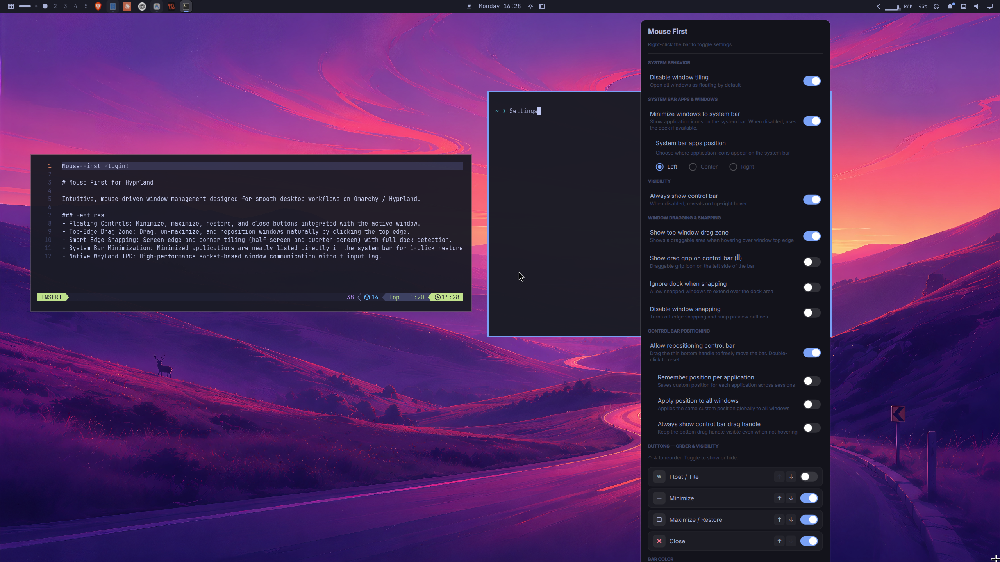

<h1 align="center">Mouse-First</h1>

<p align="center">
  <b>Intuitive, mouse-driven window management designed for Hyprland and Omarchy Quattro.</b>
</p>

<p align="center">
  
</p>

Mouse-First brings traditional mouse-friendly desktop convenience to Hyprland's dynamic tiling and floating environment. It gives every window intuitive floating controls, an edge-drag zone for effortless repositioning and un-maximizing, full-screen and quarter-screen edge snapping with dock detection, and a system bar area that neatly hosts minimized applications.

> Designed for users who love Hyprland's aesthetics and speed, but prefer the comfort, muscle memory, and flexibility of mouse-driven workflows.

<p align="center">
  
</p>

---

## Features

- **Floating Window Controls**: Sleek, theme-aware minimize, maximize/restore, and close buttons integrated directly with the active window.
- **Top-Edge Drag Zone**: Grab, move, and un-maximize windows naturally by clicking and dragging anywhere along the top edge.
- **Smart Edge Snapping**: Half-screen edge snapping (left and right) and quarter-screen corner snapping (top-left, top-right, bottom-left, bottom-right).
- **Dock & Monitor Detection**: Intelligently honors dock reservations (like OmaDock) and multi-monitor boundaries when tiling and snapping.
- **System Bar Minimization**: Minimized windows are neatly organized directly into the top bar with their real application icons and titles for 1-click restore.
- **Native Wayland Socket IPC**: Direct UNIX domain socket communication with Hyprland for zero input lag, smooth dragging, and high performance.
- **Customizable**: Configure button visibility, order, bar alignment, snapping behavior, and colors via an intuitive right-click context settings menu.

---

## Requirements

- **Omarchy Quattro** (or any modern Hyprland installation with Quickshell)
- **Quickshell** `0.3.x`
- **Hyprland** (with Wayland socket IPC)
- **Dependencies**: `jq`, `socat`

---

## Installation

### Via Official Omarchy Plugin CLI (Recommended)

To install directly using the Omarchy plugin manager:

```bash
omarchy plugin add https://github.com/DjaboDev/Mouse-First.git --enable
omarchy restart shell
```

### Via Quick Install Script

Alternatively, you can clone and run the provided interactive installer:

```bash
git clone https://github.com/DjaboDev/Mouse-First.git
cd Mouse-First
bash install.sh
```

The script will ask where you'd like minimized applications placed in the system bar (`left`, `center`, or `right`) and automatically register the plugin.

---

## Usage

- **Drag to Move**: Click and hold the top edge of any floating or tiled window to drag it across workspaces or monitors.
- **Un-maximize**: Dragging a maximized window away from the top edge smoothly un-maximizes it, keeping the window attached to your cursor.
- **Edge Snapping**: Drag a window into the left or right screen border to snap it to half screen. Touch the screen corners to snap into quarters. Pulling the window away cleanly restores its original floating size.
- **Minimize to Bar**: Click the minimize button (`—`) to send the window to the system bar. Click the app icon in the bar to bring it back into focus.
- **Settings & Preferences**: Right-click the floating control capsule on the active window to open the settings panel (toggle buttons, color theme, and drag behaviors).

---

## Configuration

Mouse-First saves your preferences to:

```text
~/.config/omarchy/mouse-first.json
```

A typical configuration file:

```json
{
  "language": "en",
  "disableTiling": true,
  "alwaysVisible": true,
  "dragFullWidth": true,
  "showDragHandle": false,
  "ignoreDock": false,
  "disableSnapping": false,
  "enableMenuDrag": true,
  "minimizeToBar": true,
  "barSection": "left",
  "buttonOrder": ["float", "minimize", "maximize", "close"],
  "buttonVisible": {
    "float": false,
    "minimize": true,
    "maximize": true,
    "close": true
  },
  "colorMode": "theme"
}
```

---

## Updating & Removal

### Update

```bash
omarchy plugin update io.github.mousefirst.controls
omarchy restart shell
```

### Removal

To remove the plugin from your system:

```bash
omarchy plugin remove io.github.mousefirst.controls --yes
omarchy restart shell
```

To clean up configuration files after removal:

```bash
rm -f ~/.config/omarchy/mouse-first.json
```

---

## License

This project is licensed under the [MIT License](LICENSE).
