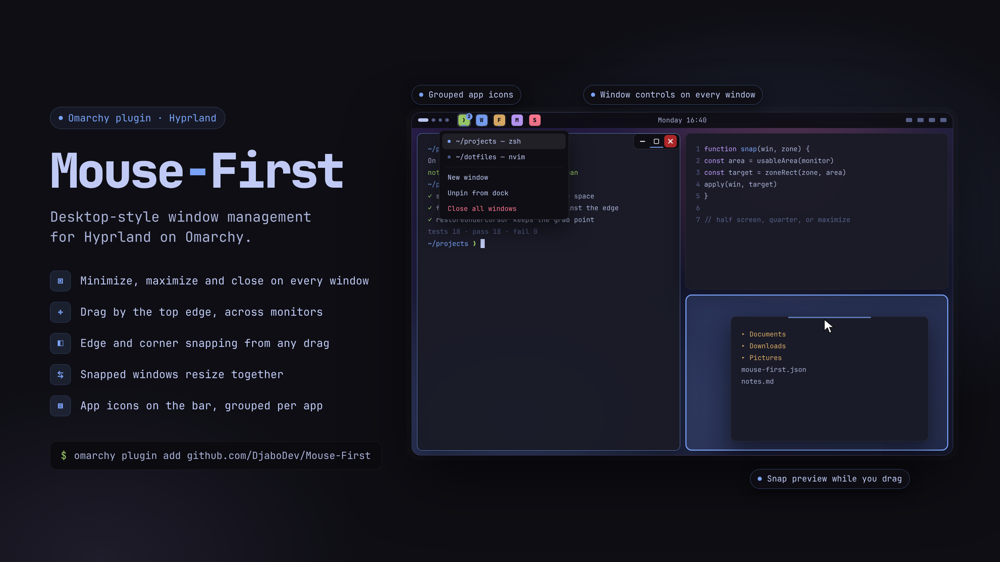
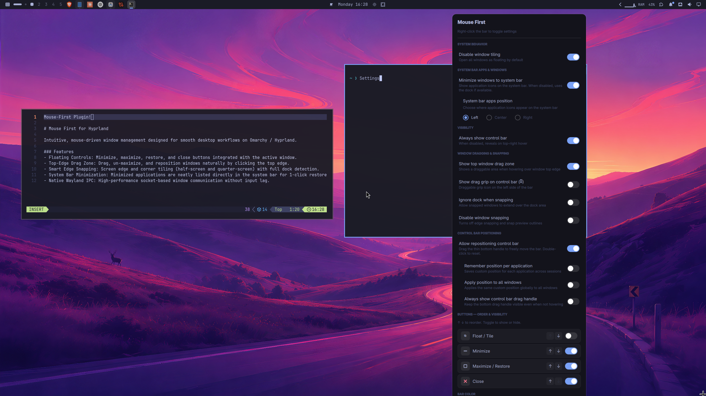

<h1 align="center">Mouse-First</h1>

<p align="center">
  <b>Mouse-driven window management for Hyprland on Omarchy.</b>
</p>

<p align="center">
  
</p>

Mouse-First adds the desktop conveniences mouse users expect to Hyprland: minimize, maximize and close buttons on the active window, dragging windows by their top edge, edge and corner snapping, and app icons on the system bar. Keyboard workflows keep working as before.

<p align="center">
  
</p>

## Features

- **Window controls.** A small capsule at the top-right corner of the active window with minimize, maximize/restore and close buttons (plus an optional float/tile button). You can reorder the buttons, hide any of them, and drag the capsule to a different spot.
- **Top-edge dragging.** Grab any window by the strip along its top edge and move it, including onto another monitor. Double-click the strip to maximize or restore.
- **Snapping.** Drop a window against a screen edge to fill half of the screen, or into a corner for a quarter. Snapped and maximized windows respect the bar, the dock and your Hyprland gaps.
- **Snapping everywhere.** Snapping and natural un-snapping work the same whether you drag by the top strip, with <kbd>SUPER</kbd> + drag, or by an app's own title bar: a snapped or maximized window returns to its previous size the moment you pull it away, staying under the cursor.
- **Split-view resizing.** Resize one of two snapped windows by its inner border and the neighbour follows, so they keep sharing the screen.
- **App icons on the bar.** Pinned and open apps appear on the system bar, one icon per app with a window count. Click to launch, focus, minimize, restore or cycle through an app's windows; right-click for a menu with its windows, *New window*, *Pin/Unpin* (shared with omadock) and *Close*. Minimized windows are shared with omadock.
- **Stays out of the way.** No controls on small windows, picture-in-picture players, or apps you exclude.
- **Floating by default (optional).** Every window opens floating, like a traditional desktop, centered or where the app chooses.
- **Optional snapping shortcuts.** <kbd>SUPER</kbd> + <kbd>CTRL</kbd> + <kbd>SHIFT</kbd> with the arrow keys.
- **English, Português and Español.**
- **Theme-aware.** Follows the Omarchy theme, or uses your own colors.
- **Lightweight.** Event-driven with no polling, and it doesn't spawn processes while you work.

## Requirements

- Omarchy 4 with its Quickshell-based shell.
- Hyprland **0.55 or newer** with a Lua configuration (the Omarchy default).

No extra packages are needed.

## Installation

```bash
omarchy plugin add https://github.com/DjaboDev/Mouse-First.git --enable
omarchy restart shell
```

The plugin is also listed in the [Omarchy plugin store](https://plugins.omarchy.org/plugin.html?id=io.github.mousefirst.controls).

## Usage

| Action | How |
| --- | --- |
| Move a window | Drag the strip along its top edge (or the optional ⠿ grip) |
| Maximize / restore | Maximize button, or double-click the top strip |
| Snap | Drag the window (top strip, <kbd>SUPER</kbd> + drag or title bar) against an edge for half the screen, or into a corner for a quarter. Optionally, the top edge maximizes |
| Un-snap / un-maximize | Drag the window away from its snapped position |
| Resize two snapped windows together | Drag the border they share |
| Minimize | Minimize button, or click the focused app's icon on the bar |
| Restore | Click the app's icon on the bar (or in omadock) |
| Cycle an app's windows | Click its bar icon repeatedly |
| App menu (windows, new window, pin, close) | Right-click its bar icon |
| Close a window from the bar | Middle-click its icon |
| Move the control capsule | Drag the thin handle under the buttons; double-click it to reset |
| Settings | Right-click the control capsule |

### Keyboard shortcuts (optional)

Turn on **Enable snapping shortcuts** in the settings for built-in bindings:

| Keys | Action |
| --- | --- |
| <kbd>SUPER</kbd> + <kbd>CTRL</kbd> + <kbd>SHIFT</kbd> + <kbd>←</kbd> / <kbd>→</kbd> | Snap to the left / right half |
| <kbd>SUPER</kbd> + <kbd>CTRL</kbd> + <kbd>SHIFT</kbd> + <kbd>↑</kbd> | Maximize or restore |
| <kbd>SUPER</kbd> + <kbd>CTRL</kbd> + <kbd>SHIFT</kbd> + <kbd>↓</kbd> | Restore a snapped/maximized window, otherwise minimize |

For other keys, every action is also available over Quickshell IPC, so you can bind it yourself in `~/.config/hypr/bindings.lua`:

```lua
local mf = "qs -p /usr/share/omarchy/shell ipc call mousefirst "
o.bind("SUPER + ALT + LEFT",  "Snap left",          mf .. "snap left")
o.bind("SUPER + ALT + RIGHT", "Snap right",         mf .. "snap right")
o.bind("SUPER + ALT + UP",    "Maximize / restore", mf .. "toggleMaximize")
o.bind("SUPER + ALT + DOWN",  "Minimize",           mf .. "minimize")
```

| Function | Description |
| --- | --- |
| `snap <zone>` | `left`, `right`, `top`, `bottom`, `top-left`, `top-right`, `bottom-left`, `bottom-right`, `maximize` |
| `toggleMaximize` | Maximize or restore the active window |
| `restore` | Restore the active window from a snap or maximize |
| `minimize` / `restoreLast` | Minimize the active window / restore the most recently minimized one |
| `settings` | Open or close the settings panel |
| `status` | Print diagnostic state as JSON (useful for bug reports) |

## Configuration

Settings are changed from the settings panel and saved to `~/.config/omarchy/mouse-first.json`. You can also edit the file by hand; changes apply immediately.

| Key | Default | Description |
| --- | --- | --- |
| `language` | from `$LANG` | `en`, `pt` or `es` |
| `disableTiling` | `true` | Open every window floating |
| `centerNewWindows` | `true` | Center new floating windows (with `disableTiling`) |
| `alwaysVisible` | `true` | Keep the control capsule visible (otherwise it appears on hover) |
| `dragFullWidth` | `true` | Enable the top-edge drag strip |
| `showDragHandle` | `false` | Show a ⠿ drag grip in the capsule |
| `disableSnapping` | `false` | Turn edge snapping off |
| `topEdgeMaximizes` | `false` | Dropping on the top edge maximizes instead of snapping to the top half |
| `enableShortcuts` | `false` | Register the built-in snapping shortcuts |
| `excludedClasses` | `[]` | Window classes that never get controls |
| `minControlsWidth` | `240` | Windows narrower than this (px) get no controls |
| `ignoreDock` | `false` | Let snapped and maximized windows cover the dock area |
| `minimizeToBar` | `true` | Show app icons on the bar (when off, they appear only if no dock is running) |
| `barSection` | `left` | Bar section for the icons (`left`, `center`, `right`) |
| `enableMenuDrag` | `true` | Allow moving the control capsule |
| `rememberMenuPerWindow` / `rememberMenuGlobal` | `false` | Keep the capsule position per application, or use one position for all windows |
| `alwaysShowMenuDragZone` | `false` | Always show the capsule's move handle |
| `buttonOrder` / `buttonVisible` | | Order and visibility of `float`, `minimize`, `maximize` and `close` |
| `colorMode` | `theme` | `theme` follows Omarchy; `custom` uses `customBg`, `customFg`, `customAccent` and `customRed` |

## How it works

- **`Service.qml`** runs once per shell. It owns the state and draws one transparent overlay per monitor. The overlay only takes input on the controls and the drag strip.
- **`src/lua/mousefirst.lua`** is loaded into Hyprland with `hyprctl eval`. It watches the active window and the monitor layout from inside the compositor and reports changes as custom IPC events, so the shell never polls. It is reloaded automatically after `hyprctl reload`.
- **Native drags are handed over.** Two non-consuming binds track the left mouse button (Hyprland's Lua API cannot read it). When Hyprland starts moving a floating window, the module ends Hyprland's drag and the shell's drag controller continues it, so every drag shares the same snapping logic.
- A note for Lua config authors: in Hyprland 0.56.2, calling a method on an `HL.Keybind` whose bind no longer exists crashes the compositor, and `:remove()` drops every bind with the same key and modifiers. The module therefore never calls methods on keybind handles.
- **`src/js/geometry.js`** holds the snapping and placement math as pure functions, covered by the tests in `tests/` (which also check that every translation is complete).
- **`BarWidget.qml`** only renders the app icons. Omarchy creates one per monitor, and all of them share the service.

Minimized windows live on `special:minimized`, the same workspace omadock uses, and each one's original workspace is remembered in `~/.local/state/mouse-first/`.

## Development

```bash
git clone https://github.com/DjaboDev/Mouse-First.git
cd Mouse-First
scripts/dev-link.sh          # symlink the checkout over the installed plugin
omarchy restart shell        # services reload only on a shell restart
node --test tests/*.test.mjs  # geometry tests
```

## Updating & removal

```bash
omarchy plugin update io.github.mousefirst.controls
omarchy restart shell
```

```bash
omarchy plugin remove io.github.mousefirst.controls --yes
omarchy restart shell
rm -rf ~/.config/omarchy/mouse-first.json ~/.local/state/mouse-first
```

## License

[MIT](LICENSE)
